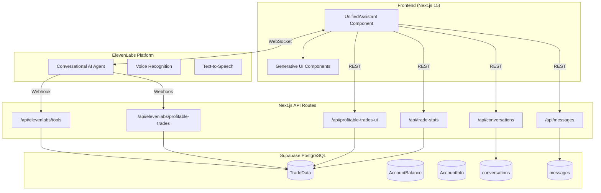
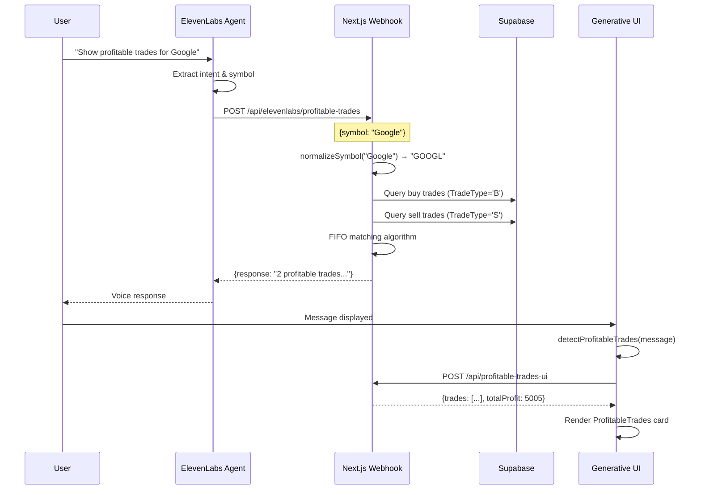
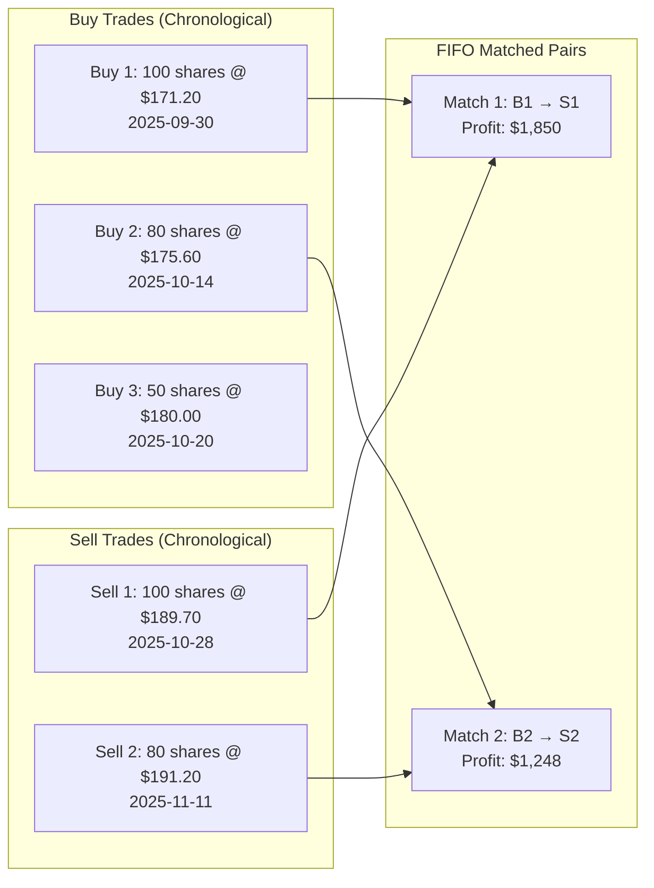
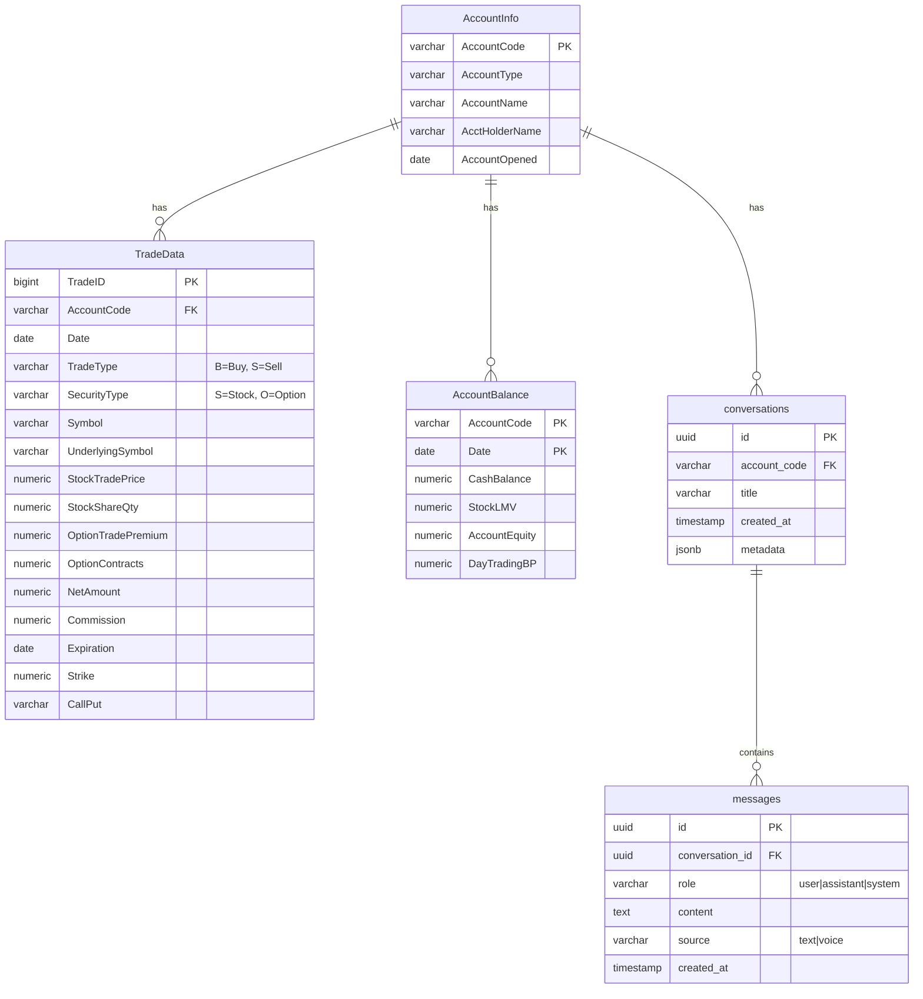
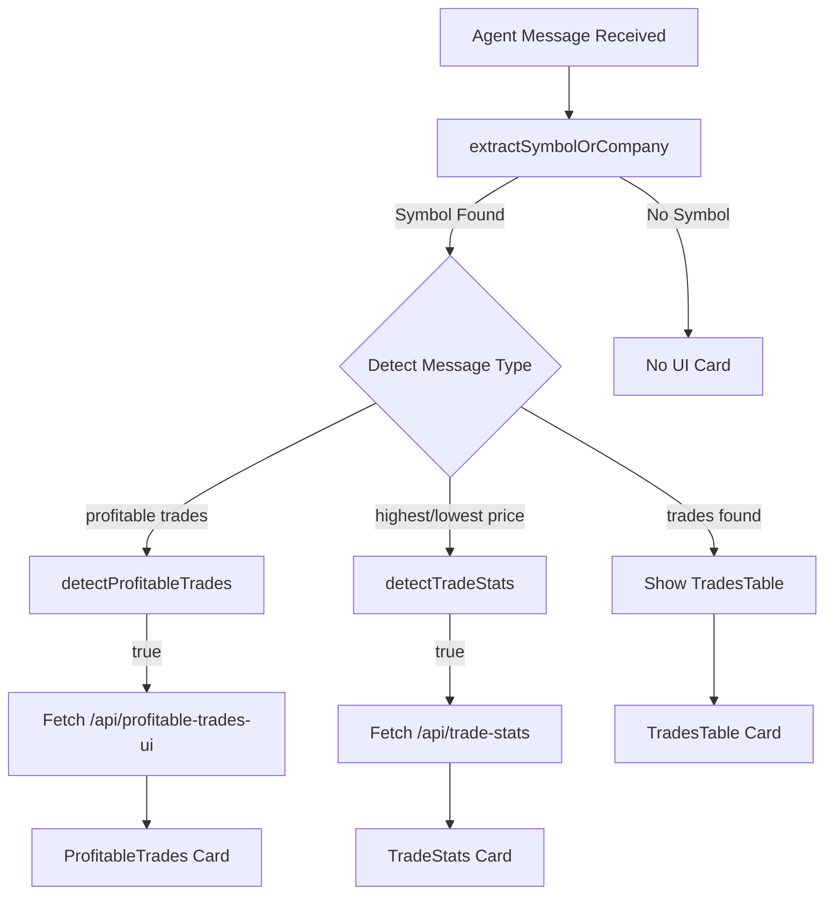

# FinAgent - AI-Powered Financial Trading Assistant

An intelligent financial agent that provides voice and text-based interaction for trading analysis, account management, and portfolio insights using cutting-edge AI technology.

## Overview

FinAgent is a sophisticated AI-powered trading assistant that combines:
- **Voice & Text Interaction** via ElevenLabs Conversational AI
- **Real-time Trade Analysis** with FIFO profit/loss calculations
- **Generative UI Components** that render rich data visualizations
- **Supabase PostgreSQL** for trade data storage
- **Next.js 15** with App Router architecture

---

## System Architecture



---

## ElevenLabs Agent Configuration

### Agent Details
- **Name**: finagent-neo
- **Agent ID**: `agent_3101kbjqgdc0fkgvt8f1zw2hbvxv`
- **Voice ID**: `ys3XeJJA4ArWMhRpcX1D`

### Agent System Prompt

The agent is configured with a comprehensive system prompt that defines its personality, capabilities, and constraints:

#### Personality & Role
```
You are FinAgent, a helpful quantitative analyst assistant. You help users
understand their trading portfolio and answer questions about their stock
and option trades.
```

#### Number Formatting Rule (Critical for TTS)
```
# CRITICAL: NUMBER FORMATTING
NEVER spell out numbers. Always use numeric format exactly as received from tools:
- "$195.80" NOT "one hundred ninety five dollars and eighty cents"
- "227 shares" NOT "two hundred twenty seven shares"
- "August 13, 2025" NOT "August thirteenth, two thousand twenty five"
```

This ensures the text-to-speech engine receives clean numeric data for natural pronunciation.

#### Agent-Level Symbol Normalization
The agent converts company names to ticker symbols before calling tools:
```
When users mention company names, convert them to the appropriate ticker symbol:
- Apple → AAPL
- Google/Alphabet → GOOGL
- Amazon → AMZN
- Microsoft → MSFT
- Tesla → TSLA
- Nvidia → NVDA
- Meta/Facebook → META
```

#### Tone & Communication Style
- **Clear, professional, and informative**
- **Friendly and approachable**, but concise
- **Free of jargon**, unless explicitly requested
- Focused on **accuracy and clarity**

#### Guardrails
| ✅ Allowed | ❌ Not Allowed |
|-----------|---------------|
| Factual portfolio data | Investment advice |
| Trade history & statistics | Personal recommendations |
| P&L calculations | Speculation or opinions |
| Market data (quotes, volume) | Disclosing internal tools |

#### Query Categories (Filtering Rules)
The agent only processes queries in these categories:
- Account balances and equity summaries
- Historical or current trades and orders
- Realized / unrealized P&L
- Fees, commissions, and interest data
- Market data (quotes, volume, fundamentals)
- Position and exposure breakdowns
- Trade statistics (highest/lowest prices, averages)

### Available Tools

The ElevenLabs agent has access to webhook tools that query trade data:

| Tool Name | Endpoint | Description |
|-----------|----------|-------------|
| `get_trade_summary` | `/api/elevenlabs/tools` | Get count of stock and option trades for a symbol |
| `get_detailed_trades` | `/api/elevenlabs/tools` | Get full trade history with details |
| `get_trade_stats` | `/api/elevenlabs/tools` | Get highest/lowest prices, averages for a symbol |
| `get_profitable_trades` | `/api/elevenlabs/profitable-trades` | Calculate profitable trades using FIFO matching |

#### Tool Usage Guidelines (from System Prompt)

| Tool | Use When User Asks... | Example Queries |
|------|----------------------|-----------------|
| `get_trade_summary` | General trade counts | "How many trades do I have for Apple?", "Show me my NVDA trades" |
| `get_detailed_trades` | Position details, cost basis | "What's my position in Tesla?", "How much did I spend on Apple?" |
| `get_trade_stats` | Price extremes, averages | "Highest price I sold NVDA at?", "Average sell price for Apple?" |
| `get_profitable_trades` | Realized gains, profit | "Show profitable trades on Apple", "How much profit on NVDA?" |

**Important**: The agent is instructed to always pass ticker symbols (AAPL, GOOGL) not company names to tools.

### Tool Webhook Flow



---

## FIFO Trade Matching Algorithm

The profitable trades calculation uses **First-In-First-Out (FIFO)** methodology to match buy and sell trades:



### Algorithm Implementation

```typescript
// 1. Fetch and sort trades chronologically
const buyTrades = await supabase
  .from('TradeData')
  .select('*')
  .eq('TradeType', 'B')
  .order('Date', { ascending: true })
  .order('TradeID', { ascending: true });

const sellTrades = await supabase
  .from('TradeData')
  .select('*')
  .ilike('TradeType', 'S')
  .order('Date', { ascending: true });

// 2. Match by security type (Stock vs Option)
for (const secType of ['S', 'O']) {
  const buys = buyTrades.filter(t => t.SecurityType === secType);
  const sells = sellTrades.filter(t => t.SecurityType === secType);
  const matchCount = Math.min(buys.length, sells.length);

  for (let i = 0; i < matchCount; i++) {
    const buy = buys[i];
    const sell = sells[i];

    // Profit = Sell proceeds + Buy cost (buy is negative)
    const profitLoss = parseFloat(sell.NetAmount) + parseFloat(buy.NetAmount);

    matchedTrades.push({
      securityType: secType === 'S' ? 'Stock' : 'Option',
      buyDate: buy.Date,
      sellDate: sell.Date,
      quantity: parseFloat(buy.StockShareQty),
      buyPrice: parseFloat(buy.StockTradePrice),
      sellPrice: parseFloat(sell.StockTradePrice),
      profitLoss
    });
  }
}
```

---

## Database Schema



---

## Generative UI Components

The application renders rich UI cards based on the agent's responses:

### Component Detection Flow



### Available Components

| Component | Trigger Patterns | Data Displayed |
|-----------|-----------------|----------------|
| `ProfitableTrades` | "profitable trades", "profit of $X" | Total profit, trade count, individual trade details |
| `TradeStats` | "highest price", "lowest sold", "average" | High/low prices with dates, averages, totals |
| `TradesTable` | "found X trades", "here are your trades" | Full trade history table |
| `TradeSummary` | "X stock trades and Y option trades" | Quick trade count summary |

---

## API Routes

### ElevenLabs Webhook Endpoints

#### `POST /api/elevenlabs/profitable-trades`

Called by ElevenLabs agent to get profitable trades for a symbol.

**Request:**
```json
{
  "symbol": "Google"
}
```

**Response:**
```json
{
  "response": "Found 2 profitable trades for GOOGL with a total profit of $5005.00. Trade 1: Stock, bought 2025-09-30 at $171.20, sold 2025-10-28 at $189.70, profit $4113.40."
}
```

#### `POST /api/elevenlabs/tools`

Multi-tool endpoint that routes based on `tool_name`:

**Request:**
```json
{
  "tool_name": "get_trade_stats",
  "parameters": {
    "symbol": "NVDA",
    "trade_type": "sell",
    "year": 2025
  }
}
```

### UI Data Endpoints

#### `POST /api/profitable-trades-ui`

Returns structured data for the ProfitableTrades component.

**Response:**
```json
{
  "symbol": "GOOGL",
  "totalProfitableTrades": 2,
  "totalProfit": 5005,
  "trades": [
    {
      "securityType": "Stock",
      "buyDate": "2025-09-30",
      "sellDate": "2025-10-28",
      "quantity": 120,
      "buyPrice": 171.20,
      "sellPrice": 189.70,
      "profitLoss": 4113.40
    }
  ]
}
```

#### `POST /api/trade-stats`

Returns trade statistics for UI card rendering.

---

## Symbol Normalization (Dual-Layer)

Symbol normalization happens at **two levels** to ensure robustness:

```mermaid
flowchart LR
    subgraph Layer1["Layer 1: Agent (System Prompt)"]
        U[User: "Apple trades"] --> A[Agent converts to AAPL]
    end

    subgraph Layer2["Layer 2: Webhook (Code)"]
        A --> W[Webhook receives "AAPL" or "Apple"]
        W --> N[normalizeSymbol function]
        N --> D[(Database Query)]
    end

    style Layer1 fill:#1a3a1a
    style Layer2 fill:#1a1a3a
```

### Layer 1: Agent-Level (System Prompt)
The ElevenLabs agent is instructed to convert company names before calling tools:
```
Apple → AAPL, Google/Alphabet → GOOGL, Tesla → TSLA, etc.
```

### Layer 2: Webhook-Level (Code Fallback)
If the agent passes a company name, the webhook handles it as a fallback:

```typescript
const SYMBOL_MAP: Record<string, string> = {
  'apple': 'AAPL',
  'google': 'GOOGL',
  'alphabet': 'GOOGL',
  'amazon': 'AMZN',
  'microsoft': 'MSFT',
  'tesla': 'TSLA',
  'nvidia': 'NVDA',
  'meta': 'META',
  'facebook': 'META',
  'netflix': 'NFLX',
  'amd': 'AMD',
  'intel': 'INTC',
  'bank of america': 'BAC',
  'citigroup': 'C',
  'gamestop': 'GME',
  'lucid': 'LCID',
};

function normalizeSymbol(input: string): string {
  const lower = input.toLowerCase().trim();
  return SYMBOL_MAP[lower] || input.toUpperCase();
}
```

This dual-layer approach ensures:
1. **Best case**: Agent sends ticker symbol directly (fastest)
2. **Fallback**: Webhook normalizes company name (robust)

---

## Project Structure

```
finagent-frontend/
├── app/
│   ├── api/
│   │   ├── elevenlabs/
│   │   │   ├── profitable-trades/    # Profitable trades webhook
│   │   │   ├── tools/                # Multi-tool webhook endpoint
│   │   │   ├── trade-summary/        # Trade summary endpoint
│   │   │   └── detailed-trades/      # Detailed trades endpoint
│   │   ├── profitable-trades-ui/     # UI data for profitable trades card
│   │   ├── trade-stats/              # Trade statistics UI data
│   │   ├── trades-ui/                # Trades table UI data
│   │   ├── conversations/            # Conversation CRUD
│   │   └── messages/                 # Message CRUD
│   ├── layout.tsx
│   └── page.tsx
├── src/
│   └── components/
│       ├── UnifiedAssistant.tsx      # Main chat/voice interface
│       └── generative-ui/
│           ├── ProfitableTrades.tsx  # Profitable trades card
│           ├── TradeStats.tsx        # Trade statistics card
│           ├── TradesTable.tsx       # Full trades table
│           └── TradeSummary.tsx      # Quick summary card
├── tool-config.json                  # ElevenLabs tool configuration
└── package.json
```

---

## Getting Started

### Prerequisites

- Node.js 20+
- Supabase account with trade data
- ElevenLabs account with agent configured

### Environment Variables

```env
# Supabase
NEXT_PUBLIC_SUPABASE_URL=your_supabase_url
NEXT_PUBLIC_SUPABASE_ANON_KEY=your_anon_key

# ElevenLabs
NEXT_PUBLIC_ELEVENLABS_AGENT_ID=agent_3101kbjqgdc0fkgvt8f1zw2hbvxv
```

### Installation

```bash
# Install dependencies
npm install

# Run development server
npm run dev

# For webhook testing, use ngrok
ngrok http 3000
```

### Configuring ElevenLabs Tools

1. Go to ElevenLabs Agent Dashboard
2. Add webhook tools with your ngrok URL:
   - `get_profitable_trades` → `https://your-ngrok.app/api/elevenlabs/profitable-trades`
   - `get_trade_stats` → `https://your-ngrok.app/api/elevenlabs/tools`

---

## Example Queries

| Query | Tool Used | UI Component |
|-------|-----------|--------------|
| "Show my profitable trades on Google" | get_profitable_trades | ProfitableTrades |
| "What's the highest price I sold NVDA at?" | get_trade_stats | TradeStats |
| "How many AAPL trades do I have?" | get_trade_summary | TradeSummary |
| "Show me all my Tesla trades" | get_detailed_trades | TradesTable |

---

## Tech Stack

| Category | Technology |
|----------|-----------|
| **Frontend** | Next.js 15, React 19, TypeScript |
| **Styling** | Inline styles (dark theme) |
| **Backend** | Next.js API Routes |
| **Database** | Supabase PostgreSQL |
| **Voice AI** | ElevenLabs Conversational AI |
| **State** | React useState/useRef |

---

## License

Private - All rights reserved

---

Built with ElevenLabs Conversational AI and Supabase
