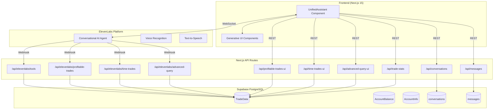
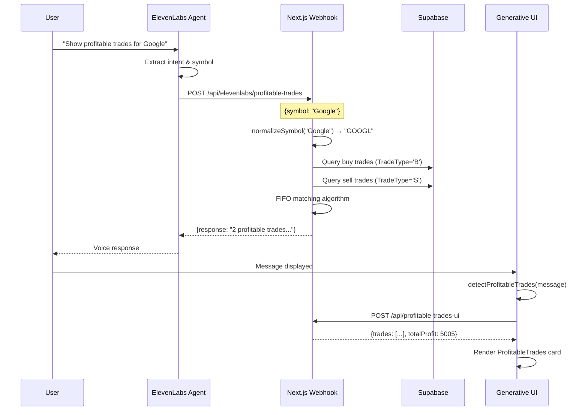
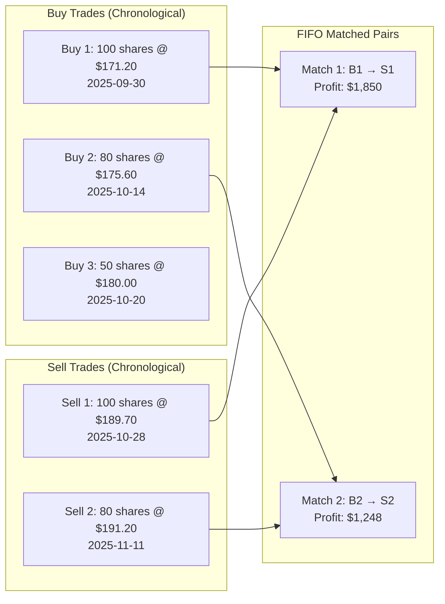
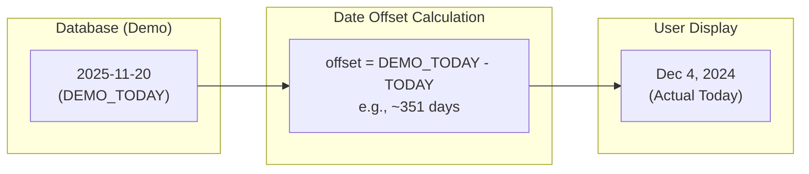
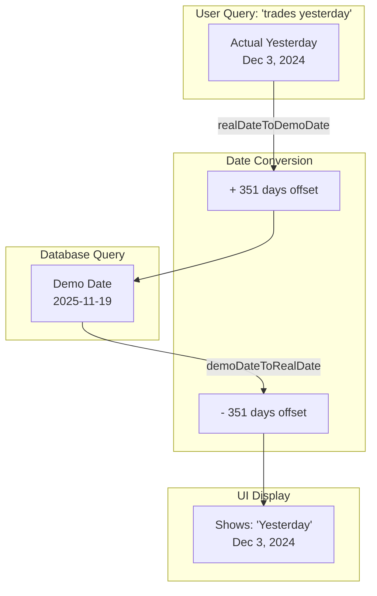
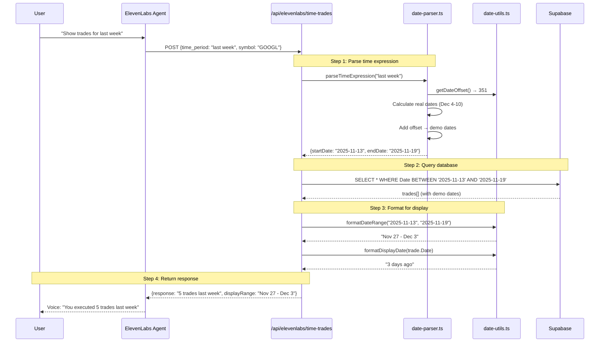
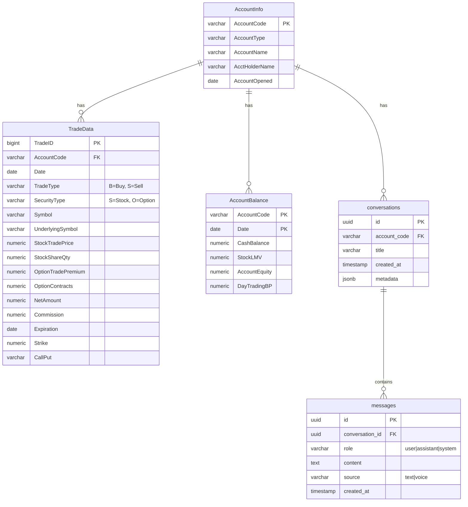
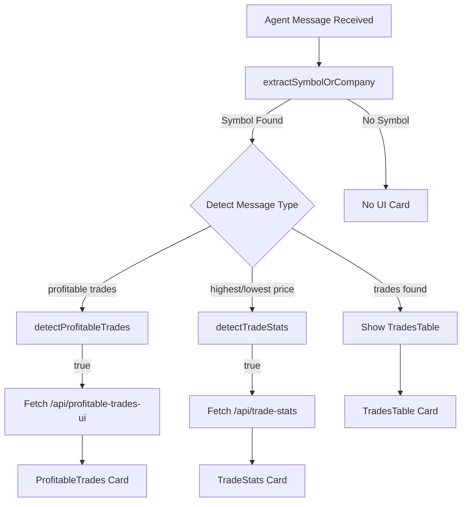

# FinAgent - AI-Powered Financial Trading Assistant

An intelligent financial agent that provides voice and text-based interaction for trading analysis, account management, and portfolio insights using cutting-edge AI technology.

## Overview

FinAgent is a sophisticated AI-powered trading assistant that combines:
- **Voice & Text Interaction** via ElevenLabs Conversational AI
- **Real-time Trade Analysis** with FIFO profit/loss calculations
- **Generative UI Components** that render rich data visualizations
- **Supabase PostgreSQL** for trade data storage
- **Next.js 15** with App Router architecture

---

## System Architecture



---

## ElevenLabs Agent Configuration

### Agent Details
- **Name**: finagent-neo
- **Agent ID**: `agent_3101kbjqgdc0fkgvt8f1zw2hbvxv`
- **Voice ID**: `ys3XeJJA4ArWMhRpcX1D`

### Agent System Prompt

The agent is configured with a comprehensive system prompt that defines its personality, capabilities, and constraints:

#### Personality & Role
```
You are FinAgent, a helpful quantitative analyst assistant. You help users
understand their trading portfolio and answer questions about their stock
and option trades.
```

#### Number Formatting Rule (Critical for TTS)
```
# CRITICAL: NUMBER FORMATTING
NEVER spell out numbers. Always use numeric format exactly as received from tools:
- "$195.80" NOT "one hundred ninety five dollars and eighty cents"
- "227 shares" NOT "two hundred twenty seven shares"
- "August 13, 2025" NOT "August thirteenth, two thousand twenty five"
```

This ensures the text-to-speech engine receives clean numeric data for natural pronunciation.

#### Agent-Level Symbol Normalization
The agent converts company names to ticker symbols before calling tools:
```
When users mention company names, convert them to the appropriate ticker symbol:
- Apple → AAPL
- Google/Alphabet → GOOGL
- Amazon → AMZN
- Microsoft → MSFT
- Tesla → TSLA
- Nvidia → NVDA
- Meta/Facebook → META
```

#### Tone & Communication Style
- **Clear, professional, and informative**
- **Friendly and approachable**, but concise
- **Free of jargon**, unless explicitly requested
- Focused on **accuracy and clarity**

#### Guardrails
| ✅ Allowed | ❌ Not Allowed |
|-----------|---------------|
| Factual portfolio data | Investment advice |
| Trade history & statistics | Personal recommendations |
| P&L calculations | Speculation or opinions |
| Market data (quotes, volume) | Disclosing internal tools |

#### Query Categories (Filtering Rules)
The agent only processes queries in these categories:
- Account balances and equity summaries
- Historical or current trades and orders
- Realized / unrealized P&L
- Fees, commissions, and interest data
- Market data (quotes, volume, fundamentals)
- Position and exposure breakdowns
- Trade statistics (highest/lowest prices, averages)

### Available Tools

The ElevenLabs agent has access to webhook tools that query trade data:

| Tool Name | Endpoint | Description |
|-----------|----------|-------------|
| `get_trade_summary` | `/api/elevenlabs/tools` | Get count of stock and option trades for a symbol |
| `get_detailed_trades` | `/api/elevenlabs/tools` | Get full trade history with details |
| `get_trade_stats` | `/api/elevenlabs/trade-stats` | Get highest/lowest prices, averages for a symbol |
| `get_profitable_trades` | `/api/elevenlabs/profitable-trades` | Calculate profitable trades using FIFO matching |
| `get_time_based_trades` | `/api/elevenlabs/time-trades` | Get trades for a time period (last week, yesterday, Nov 18th) |
| `advanced_query` | `/api/elevenlabs/advanced-query` | Flexible option queries (short/long calls/puts, by date/expiration/strike) |

#### Tool Usage Guidelines (from System Prompt)

| Tool | Use When User Asks... | Example Queries |
|------|----------------------|-----------------|
| `get_trade_summary` | General trade counts | "How many trades do I have for Apple?", "Show me my NVDA trades" |
| `get_detailed_trades` | Position details, cost basis | "What's my position in Tesla?", "How much did I spend on Apple?" |
| `get_trade_stats` | Price extremes, averages | "Highest price I sold NVDA at?", "Average sell price for Apple?" |
| `get_profitable_trades` | Realized gains, profit | "Show profitable trades on Apple", "How much profit on NVDA?" |
| `get_time_based_trades` | Trades for a time period | "Show trades for last week", "Yesterday's trades", "Trades on November 18th" |
| `advanced_query` | Option-specific queries | "Show all short calls on Tesla last month", "What's my highest strike put?" |

**Important**: The agent is instructed to always pass ticker symbols (AAPL, GOOGL) not company names to tools.

### Tool Webhook Flow



---

## FIFO Trade Matching Algorithm

The profitable trades calculation uses **First-In-First-Out (FIFO)** methodology to match buy and sell trades:



### Algorithm Implementation

```typescript
// 1. Fetch and sort trades chronologically
const buyTrades = await supabase
  .from('TradeData')
  .select('*')
  .eq('TradeType', 'B')
  .order('Date', { ascending: true })
  .order('TradeID', { ascending: true });

const sellTrades = await supabase
  .from('TradeData')
  .select('*')
  .ilike('TradeType', 'S')
  .order('Date', { ascending: true });

// 2. Match by security type (Stock vs Option) using proper FIFO
for (const secType of ['S', 'O']) {
  // Track which buys have been matched
  const buys = buyTrades
    .filter(t => t.SecurityType === secType)
    .map(t => ({ ...t, matched: false }));
  const sells = sellTrades.filter(t => t.SecurityType === secType);

  // For each sell, find earliest unmatched buy that occurred BEFORE the sell
  for (const sell of sells) {
    const sellDate = new Date(sell.Date);

    const matchingBuy = buys.find(buy =>
      !buy.matched && new Date(buy.Date) <= sellDate
    );

    if (matchingBuy) {
      matchingBuy.matched = true;

      const buyPrice = parseFloat(matchingBuy.StockTradePrice);
      const sellPrice = parseFloat(sell.StockTradePrice);
      const quantity = parseFloat(matchingBuy.StockShareQty);

      // Profit calculated from actual prices
      const profitLoss = (sellPrice - buyPrice) * quantity;

      matchedTrades.push({
        securityType: secType === 'S' ? 'Stock' : 'Option',
        buyDate: matchingBuy.Date,
        sellDate: sell.Date,
        quantity,
        buyPrice,
        sellPrice,
        profitLoss
      });
    }
  }
}

// Only include trades where sellPrice > buyPrice (actual profit)
const profitableTrades = matchedTrades.filter(t => t.profitLoss > 0);
```

### Key FIFO Rules

1. **Chronological matching**: Each sell is matched with the earliest unmatched buy
2. **Temporal constraint**: A sell can only match a buy that occurred on or before the sell date
3. **Price-based profit**: Profit = `(sellPrice - buyPrice) × quantity`
4. **True profitability**: Only trades where `sellPrice > buyPrice` are considered profitable

---

## Option Premium Math

Option calculations follow standard options math where **1 contract = 100 shares**:

### Key Calculations

| Metric | Formula | Example |
|--------|---------|---------|
| **Total Premium** | `premium_per_share × contracts × 100` | $3.69 × 226 × 100 = $83,394 |
| **Shares Covered** | `contracts × 100` | 226 contracts = 22,600 shares |
| **Average Premium per Share** | `total_premium / contracts / 100` | $83,509 / 226 / 100 = $3.69 |

### Important Distinction

- **OptionTradePremium** in the database is the **per-share price** (e.g., $3.69)
- **Per-contract premium** = per-share price × 100 (e.g., $3.69 × 100 = $369)
- The agent response says "average premium **per share**" to be precise

---

## Date Utilities & Demo Data Mapping

The application uses **demo trade data** with future dates (2025) that are dynamically mapped to display as recent dates relative to today. This allows the demo to always show relevant "recent" trades without needing to update the database.

### Why Demo Dates?

The demo database contains trade data with dates centered around `2025-11-20`. Without date mapping:
- "Yesterday's trades" would return nothing (the actual date doesn't exist in demo data)
- "Last week" would show ancient trades or nothing at all
- Time-based queries would be useless for demos

The date utility system solves this by creating a **bidirectional mapping** between real dates and demo dates.

### Date Offset System

The core concept is a **date offset** - the number of days between the demo "today" (`2025-11-20`) and the actual current date.



**How it works:**
1. `DEMO_TODAY` is set to `2025-11-20` (the "today" in the demo timeline)
2. The offset is calculated: `offset = DEMO_TODAY - actualToday`
3. **For queries**: Add offset to real dates → get DB dates
4. **For display**: Subtract offset from DB dates → get display dates

### Bidirectional Date Conversion



### Core Functions (`src/lib/date-utils.ts`)

| Function | Purpose | Example |
|----------|---------|---------|
| `getDateOffset()` | Calculate days between `DEMO_TODAY` and actual today | Returns `351` if actual today is Dec 4, 2024 |
| `realDateToDemoDate(date)` | Convert real date → DB date (add offset) | Dec 3, 2024 → 2025-11-19 |
| `demoDateToRealDate(dbDate)` | Convert DB date → real date (subtract offset) | 2025-11-19 → Dec 3, 2024 |
| `formatDisplayDate(dbDate)` | Format DB date as relative string | 2025-11-19 → "Yesterday" |
| `formatCalendarDate(dbDate)` | Format DB date as calendar string | 2025-11-19 → "Dec 3, 2024" |
| `formatDateRange(start, end)` | Format DB date range for display | "Nov 27 - Dec 3" |
| `getDayOfWeek(dbDate)` | Get day name from DB date | 2025-11-18 → "Monday" |
| `getDemoToday()` | Get the `DEMO_TODAY` constant | "2025-11-20" |
| `formatDateForDB(date)` | Format a Date object as YYYY-MM-DD | Date → "2025-11-20" |

### Implementation Details

```typescript
// The anchor date in demo database representing "today"
const DEMO_TODAY = '2025-11-20';

// Calculate offset (positive when demo is in future)
export function getDateOffset(): number {
  const actualToday = new Date();
  const [year, month, day] = DEMO_TODAY.split('-').map(Number);
  const demoToday = new Date(year, month - 1, day);
  const diffMs = demoToday.getTime() - actualToday.getTime();
  return Math.round(diffMs / (1000 * 60 * 60 * 24));
}

// Convert real date → DB date (for queries)
export function realDateToDemoDate(realDate: Date): Date {
  const offset = getDateOffset();
  const demoDate = new Date(realDate);
  demoDate.setDate(demoDate.getDate() + offset); // ADD offset
  return demoDate;
}

// Convert DB date → display date (for UI)
export function demoDateToRealDate(demoDateStr: string): Date {
  const offset = getDateOffset();
  const [year, month, day] = demoDateStr.split('-').map(Number);
  const demoDate = new Date(year, month - 1, day);
  demoDate.setDate(demoDate.getDate() - offset); // SUBTRACT offset
  return demoDate;
}
```

### Natural Language Date Parsing (`src/lib/date-parser.ts`)

The date parser converts natural language time expressions into database-ready date ranges.

#### Supported Time Expressions

| Category | Examples | Parsed Result |
|----------|----------|---------------|
| **Relative Days** | "today", "yesterday" | Single date range |
| **Relative Ranges** | "last week", "this week", "last month", "this month" | Multi-day range |
| **N Days** | "last 5 days", "past 10 days" | N-day range ending today |
| **Trading Days** | "last 3 trading days", "past five trading days" | Approximated calendar range (×7/5) |
| **Day Names** | "Monday", "Tuesday", "last Friday" | Most recent occurrence |
| **Specific Dates** | "November 18th", "Nov 18", "December 3rd" | Exact calendar date |
| **Spelled Numbers** | "last five days", "past twenty days" | Converts words to numbers |

#### Key Functions

| Function | Purpose |
|----------|---------|
| `parseTimeExpression(expr)` | Parse natural language → DateRange with DB-adjusted dates |
| `extractTimePeriodFromQuery(query)` | Extract time portion from a full query ("trades for last week" → "last week") |
| `isTimeBasedQuery(query)` | Check if query contains a time expression |

#### DateRange Interface

```typescript
interface DateRange {
  startDate: string;   // YYYY-MM-DD (DB-adjusted)
  endDate: string;     // YYYY-MM-DD (DB-adjusted)
  description: string; // Human-readable ("last week")
  tradingDays: number; // Calendar days in range
}
```

### Time-Based Query Flow

Complete flow from user query to displayed results:



### Usage Examples

#### Querying with Time Expressions
```typescript
// User asks: "Show my Apple trades from last week"
const parsed = parseTimeExpression("last week");
// Returns: { startDate: "2025-11-13", endDate: "2025-11-19", ... }

// Query database with demo dates
const trades = await supabase
  .from('TradeData')
  .select('*')
  .gte('Date', parsed.dateRange.startDate)
  .lte('Date', parsed.dateRange.endDate);
```

#### Displaying Dates to Users
```typescript
// Trade from database has: Date = "2025-11-18"
const displayDate = formatDisplayDate("2025-11-18");
// Returns: "2 days ago" (when actual today is Dec 6, 2024)

const calendarDate = formatCalendarDate("2025-11-18");
// Returns: "Dec 4, 2024"
```

### Important Notes

1. **Timezone Handling**: All dates are parsed as local dates (not UTC) to avoid timezone-related off-by-one errors
2. **Future Date Logic**: When parsing "November 18th", if that date is in the future, the parser assumes the user means last year
3. **Trading Days**: "Last 5 trading days" approximates to ~7 calendar days (5 × 7/5) since the DB doesn't track market holidays
4. **Offset Recalculation**: The offset is recalculated on each call to handle date changes during long sessions

---

## Database Schema



---

## Generative UI Components

The application renders rich UI cards based on the agent's responses:

### Component Detection Flow



### Available Components

| Component | Trigger Patterns | Data Displayed |
|-----------|-----------------|----------------|
| `ProfitableTrades` | "profitable trades", "profit of $X", "most profitable" | Total profit, trade count, individual trade details |
| `TradeStats` | "highest price", "lowest sold", "average" (full year) | High/low prices with dates, averages, totals for the year |
| `TimePeriodStats` | "highest price last month", "average price last week" (with high/low) | High/low/average prices for specific time periods |
| `AveragePrice` | "average price was $X", "paid an average of $X" (simple average only) | Focused average price display with range visualization |
| `TradesTable` | "found X trades", "here are your trades" | Full trade history table |
| `TradeSummary` | "X stock trades and Y option trades" | Quick trade count summary |
| `TimeBasedTrades` | "trades last week", "executed X trades yesterday" | Time period summary, trade list with display dates |
| `AdvancedOptionsTable` | "sold N call option contracts", "across N trades" (bulk options) | Options table with strike, expiration, premium, aggregations |
| `TradeQueryCard` | Displayed with query results | Shows active filters (symbol, date range, call/put, etc.) |
| `HighestStrikeCard` | "highest strike", "maximum strike" | Single highest/lowest strike trade details |
| `TotalPremiumCard` | "total premium", "collected/paid total" | Total premium aggregated across trades |
| `ExpiringOptionsTable` | "options expiring tomorrow/this week" | Options grouped by expiration with pagination, parsed symbols, urgency indicators |
| `LastOptionTradeCard` | "last/most recent call/put option" (single trade) | Most recent option trade details |

---

## API Routes

### ElevenLabs Webhook Endpoints

#### `POST /api/elevenlabs/profitable-trades`

Called by ElevenLabs agent to get profitable trades for a symbol.

**Request:**
```json
{
  "symbol": "Google"
}
```

**Response:**
```json
{
  "response": "Found 2 profitable trades for GOOGL with a total profit of $5005.00. Trade 1: Stock, bought 2025-09-30 at $171.20, sold 2025-10-28 at $189.70, profit $4113.40."
}
```

#### `POST /api/elevenlabs/tools`

Multi-tool endpoint that routes based on `tool_name`:

**Request:**
```json
{
  "tool_name": "get_trade_stats",
  "parameters": {
    "symbol": "NVDA",
    "trade_type": "sell",
    "year": 2025
  }
}
```

### UI Data Endpoints

#### `POST /api/profitable-trades-ui`

Returns structured data for the ProfitableTrades component.

**Response:**
```json
{
  "symbol": "GOOGL",
  "totalProfitableTrades": 2,
  "totalProfit": 5005,
  "trades": [
    {
      "securityType": "Stock",
      "buyDate": "2025-09-30",
      "sellDate": "2025-10-28",
      "quantity": 120,
      "buyPrice": 171.20,
      "sellPrice": 189.70,
      "profitLoss": 4113.40
    }
  ]
}
```

#### `POST /api/trade-stats`

Returns trade statistics for UI card rendering.

#### `POST /api/elevenlabs/time-trades`

Called by ElevenLabs agent to get trades for a specific time period.

**Request:**
```json
{
  "time_period": "last week",
  "symbol": "GOOGL",
  "trade_type": "buy"
}
```

**Response:**
```json
{
  "response": "You executed 5 trades for GOOGL last week over 7 trading days. Would you like a detailed list?",
  "data": {
    "tradeCount": 5,
    "stockCount": 4,
    "optionCount": 1,
    "timePeriod": "last week",
    "displayRange": "Nov 27 - Dec 3",
    "tradingDays": 7,
    "startDate": "Nov 27",
    "endDate": "Dec 3",
    "symbol": "GOOGL",
    "totalValue": 50000.00,
    "trades": [...]
  }
}
```

**Supported Time Periods:**
- Relative: `today`, `yesterday`, `last week`, `this month`
- N Days: `last 5 days`, `past 10 trading days`
- Day Names: `Monday`, `Tuesday`, `last Friday`
- Specific Dates: `November 18th`, `Nov 18`, `December 3rd`

#### `POST /api/time-trades-ui`

Returns structured data for the TimeBasedTrades UI component.

---

## Symbol Normalization (Dual-Layer)

Symbol normalization happens at **two levels** to ensure robustness:

```mermaid
flowchart LR
    subgraph Layer1["Layer 1: Agent - System Prompt"]
        U[User says Apple trades] --> A[Agent converts to AAPL]
    end

    subgraph Layer2["Layer 2: Webhook - Code"]
        A --> W[Webhook receives symbol]
        W --> N[normalizeSymbol function]
        N --> D[(Database Query)]
    end

    style Layer1 fill:#1a3a1a
    style Layer2 fill:#1a1a3a
```



### Layer 1: Agent-Level (System Prompt)
The ElevenLabs agent is instructed to convert company names before calling tools:
```
Apple → AAPL, Google/Alphabet → GOOGL, Tesla → TSLA, etc.
```

### Layer 2: Webhook-Level (Code Fallback)
If the agent passes a company name, the webhook handles it as a fallback:

```typescript
const SYMBOL_MAP: Record<string, string> = {
  'apple': 'AAPL',
  'google': 'GOOGL',
  'alphabet': 'GOOGL',
  'amazon': 'AMZN',
  'microsoft': 'MSFT',
  'tesla': 'TSLA',
  'nvidia': 'NVDA',
  'meta': 'META',
  'facebook': 'META',
  'netflix': 'NFLX',
  'amd': 'AMD',
  'intel': 'INTC',
  'bank of america': 'BAC',
  'citigroup': 'C',
  'gamestop': 'GME',
  'lucid': 'LCID',
};

function normalizeSymbol(input: string): string {
  const lower = input.toLowerCase().trim();
  return SYMBOL_MAP[lower] || input.toUpperCase();
}
```

This dual-layer approach ensures:
1. **Best case**: Agent sends ticker symbol directly (fastest)
2. **Fallback**: Webhook normalizes company name (robust)

---

## Project Structure

```
finagent-frontend/
├── app/
│   ├── api/
│   │   ├── elevenlabs/
│   │   │   ├── profitable-trades/    # Profitable trades webhook
│   │   │   ├── time-trades/          # Time-based trades webhook
│   │   │   ├── trade-stats/          # Trade statistics webhook
│   │   │   ├── advanced-query/       # Advanced options query webhook
│   │   │   ├── tools/                # Multi-tool webhook endpoint
│   │   │   ├── trade-summary/        # Trade summary endpoint
│   │   │   └── detailed-trades/      # Detailed trades endpoint
│   │   ├── profitable-trades-ui/     # UI data for profitable trades card
│   │   ├── time-trades-ui/           # UI data for time-based trades card
│   │   ├── advanced-query-ui/        # UI data for advanced options queries
│   │   ├── trade-stats/              # Trade statistics UI data
│   │   ├── trades-ui/                # Trades table UI data
│   │   ├── average-price/            # Average price UI data
│   │   ├── conversations/            # Conversation CRUD
│   │   └── messages/                 # Message CRUD
│   ├── layout.tsx
│   └── page.tsx
├── src/
│   ├── lib/
│   │   ├── date-utils.ts             # Date offset utilities for demo data
│   │   └── date-parser.ts            # Natural language date parsing
│   └── components/
│       ├── UnifiedAssistant.tsx      # Main chat/voice interface
│       ├── QueryBuilder.tsx          # Manual query builder modal
│       └── generative-ui/
│           ├── AdvancedOptionsTable.tsx  # Bulk options trades table
│           ├── AveragePrice.tsx          # Focused average price card
│           ├── ExpiringOptionsTable.tsx  # Options expiring soon table
│           ├── HighestStrikeCard.tsx     # Highest/lowest strike card
│           ├── LastOptionTradeCard.tsx   # Most recent option trade card
│           ├── ProfitableTrades.tsx      # Profitable trades card
│           ├── TimeBasedTrades.tsx       # Time-based trades card
│           ├── TimePeriodStats.tsx       # Time-period price stats card
│           ├── TotalPremiumCard.tsx      # Total premium aggregation card
│           ├── TradeQueryCard.tsx        # Query filter display card
│           ├── TradeStats.tsx            # Trade statistics card (full year)
│           ├── TradesTable.tsx           # Full trades table
│           └── TradeSummary.tsx          # Quick summary card
├── tool-config.json                  # ElevenLabs tool configuration
└── package.json
```

---

## Getting Started

### Prerequisites

- Node.js 20+
- Supabase account with trade data
- ElevenLabs account with agent configured

### Environment Variables

```env
# Supabase
NEXT_PUBLIC_SUPABASE_URL=your_supabase_url
NEXT_PUBLIC_SUPABASE_ANON_KEY=your_anon_key

# ElevenLabs
NEXT_PUBLIC_ELEVENLABS_AGENT_ID=agent_3101kbjqgdc0fkgvt8f1zw2hbvxv
```

### Installation

```bash
# Install dependencies
npm install

# Run development server
npm run dev

# For webhook testing, use ngrok
ngrok http 3000
```

### Configuring ElevenLabs Tools

1. Go to ElevenLabs Agent Dashboard
2. Add webhook tools with your ngrok URL:
   - `get_profitable_trades` → `https://your-ngrok.app/api/elevenlabs/profitable-trades`
   - `get_trade_stats` → `https://your-ngrok.app/api/elevenlabs/tools`

---

## Example Queries

| Query | Tool Used | UI Component |
|-------|-----------|--------------|
| "Show my profitable trades on Google" | get_profitable_trades | ProfitableTrades |
| "What's my most profitable Apple trade?" | get_profitable_trades | ProfitableTrades |
| "What's the highest price I sold NVDA at?" | get_trade_stats | TradeStats |
| "What was the average price I bought Apple for last month?" | get_trade_stats | AveragePrice |
| "Average price I bought Apple at last month" (with highest/lowest) | get_trade_stats | TimePeriodStats |
| "Highest price I paid for GOOGL last week" | get_trade_stats | TimePeriodStats |
| "How many AAPL trades do I have?" | get_trade_summary | TradeSummary |
| "Show me all my Tesla trades" | get_detailed_trades | TradesTable |
| "Show my trades from last week" | get_time_based_trades | TimeBasedTrades |
| "What trades did I make yesterday?" | get_time_based_trades | TimeBasedTrades |
| "GOOGL trades on November 18th" | get_time_based_trades | TimeBasedTrades |
| "Show trades for the past 5 days" | get_time_based_trades | TimeBasedTrades |
| "Show all short call options on Tesla last month" | advanced_query | AdvancedOptionsTable |
| "What's my highest strike put option?" | advanced_query | HighestStrikeCard |
| "How much premium did I collect selling calls?" | advanced_query | TotalPremiumCard |
| "What options are expiring this week?" | advanced_query | ExpiringOptionsTable |
| "What was my last call option trade?" | advanced_query | LastOptionTradeCard |
| "Show all long puts on Apple" | advanced_query | AdvancedOptionsTable |

---

## Tech Stack

| Category | Technology |
|----------|-----------|
| **Frontend** | Next.js 15, React 19, TypeScript |
| **Styling** | Inline styles (dark theme) |
| **Backend** | Next.js API Routes |
| **Database** | Supabase PostgreSQL |
| **Voice AI** | ElevenLabs Conversational AI |
| **State** | React useState/useRef |

---

## License

Private - All rights reserved

---

Built with ElevenLabs Conversational AI and Supabase
