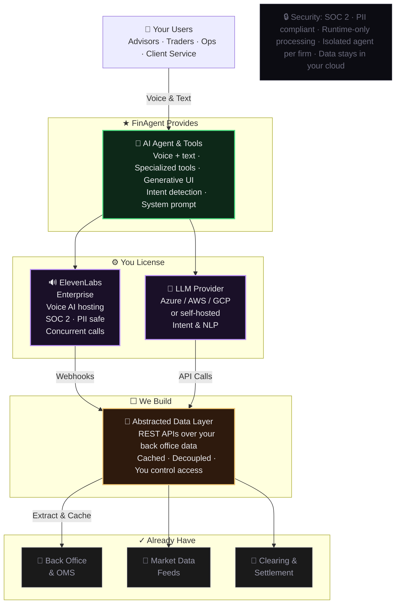

# FinAgent — Enterprise Deployment Architecture

## Detailed Architecture

```mermaid
graph TB
    %% ── Styles ──────────────────────────────────────────────────
    classDef users fill:#1a1a2e,stroke:#4a4a5c,color:#e8e8ec,stroke-width:1px
    classDef finagent fill:#0d2818,stroke:#4ade80,color:#e8e8ec,stroke-width:2px
    classDef licensed fill:#1a1028,stroke:#bd93f9,color:#e8e8ec,stroke-width:2px
    classDef appLayer fill:#0d1a2e,stroke:#60a5fa,color:#e8e8ec,stroke-width:2px
    classDef dataLayer fill:#2e1a0d,stroke:#f0c674,color:#e8e8ec,stroke-width:2px
    classDef existing fill:#1a1a1a,stroke:#4a4a5c,color:#9a9aac,stroke-width:1px
    classDef summary fill:#0c0c12,stroke:#2a2a3a,color:#e8e8ec,stroke-width:1px

    %% ── Users ───────────────────────────────────────────────────
    subgraph USERS ["👤 YOUR USERS"]
        U1["Financial Advisors"]
        U2["Traders"]
        U3["Operations"]
        U4["Client Service Reps"]
    end

    %% ── FinAgent AI Layer ───────────────────────────────────────
    subgraph FINAGENT ["★ FINAGENT AI LAYER — What We Provide"]
        FA1["🤖 AI Voice & Text Agent
        ─────────────────────
        • Natural voice interaction
        • System prompt customized to your firm
        • Specialized tools
        • Intent classification & query routing
        • Generative UI data cards"]
    end

    %% ── Licensed Services ───────────────────────────────────────
    subgraph LICENSED ["⚙ LICENSED SERVICES — You Subscribe"]
        direction LR
        subgraph VOICE ["Voice AI Platform"]
            EL["🔊 ElevenLabs Enterprise
            ─────────────────────
            • Voice agent hosting
            • Speech-to-text & text-to-speech
            • SOC 2 compliant
            • PII handling (enterprise)
            • Concurrent calls
            • Runtime processing only
            • One agent per client firm"]
        end
        subgraph LLM ["LLM Provider (Your Choice)"]
            LP["🧠 LLM Provider
            ─────────────────────
            • Azure OpenAI
            • AWS Bedrock
            • Google Cloud AI
            • Self-hosted
            ─────────────────────
            Used for:
            • Intent classification
            • Date/symbol disambiguation
            • Query assistance"]
        end
    end

    %% ── Application Layer ───────────────────────────────────────
    subgraph APP ["★ APPLICATION LAYER — We Implement"]
        direction LR
        T1["📊 Trade Tools
        • Summary
        • Detail
        • Stats
        • P/L"]
        T2["💰 Account Tools
        • Balance
        • Positions
        • Margin"]
        T3["📋 Options Tools
        • Chains
        • Expiring
        • Premium"]
        T4["📈 Market & Fundamentals
        • Quotes & Charts
        • News
        • Company Overview"]
        T5["💸 Fee Tools
        • Commissions
        • Interest
        • Locate Fees"]
    end

    %% ── Abstracted Data Layer ───────────────────────────────────
    subgraph DATA ["☐ ABSTRACTED DATA LAYER — We Build"]
        direction LR
        D1["📁 Trade History
        Buy/sell, stocks & options,
        timestamps, prices, qty"]
        D2["📁 Account & Balances
        Cash, equity, buying power,
        margin, day trading BP"]
        D3["📁 Fees & Interest
        Commissions, debit/credit
        interest, locate fees"]
        D4["📁 Positions & Transfers
        Current holdings,
        fund in/out, journals"]

        DN["ℹ️ Why this layer matters:
        • Back office runs batch processing — can lock up for hours
        • This layer caches data so queries never hit back office directly
        • You control exactly what data is exposed to the AI
        • Standard REST APIs — framework agnostic (Java, Python, C#, etc.)"]
    end

    %% ── Existing Infrastructure ─────────────────────────────────
    subgraph INFRA ["✓ YOUR EXISTING INFRASTRUCTURE — Already Have"]
        direction LR
        I1["🏢 Back Office / OMS
        Trade execution,
        account management,
        compliance"]
        I2["📡 Market Data Feeds
        Real-time quotes,
        historical data,
        corporate actions"]
        I3["🏦 Clearing & Settlement
        DTCC, OCC,
        reconciliation,
        statements"]
    end

    %% ── Connections ─────────────────────────────────────────────
    USERS -->|"Voice & Text"| FINAGENT
    FINAGENT -->|"Tool Calls"| LP
    FINAGENT -->|"Voice & Speech"| EL
    LP -->|"API Requests"| APP
    EL -->|"Webhook Calls"| APP
    APP -->|"Data Queries (REST)"| DATA
    DATA -->|"Extract & Cache"| INFRA

    %% ── Apply Styles ────────────────────────────────────────────
    class U1,U2,U3,U4 users
    class FA1 finagent
    class EL,LP licensed
    class T1,T2,T3,T4,T5 appLayer
    class D1,D2,D3,D4,DN dataLayer
    class I1,I2,I3 existing
```

---

## Condensed Single-Slide View

---

## Legend

| Symbol | Meaning |
|--------|---------|
| ★ | **FinAgent provides** — Agent, tools, system prompt, implementation |
| ⚙ | **You license** — ElevenLabs Enterprise + LLM provider |
| ☐ | **We build** — Abstracted data layer (REST APIs) |
| ✓ | **You already have** — Back office, market data, clearing |
